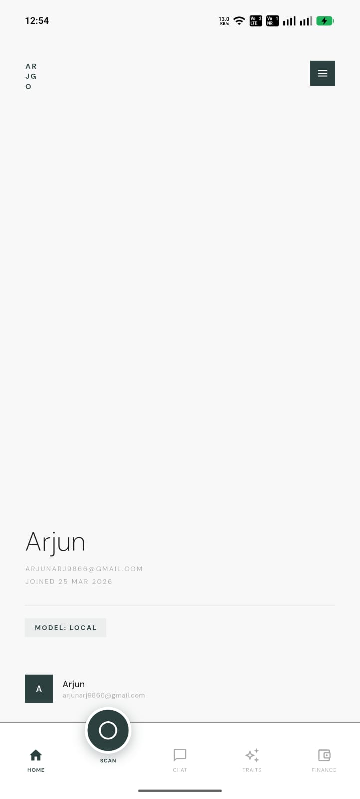
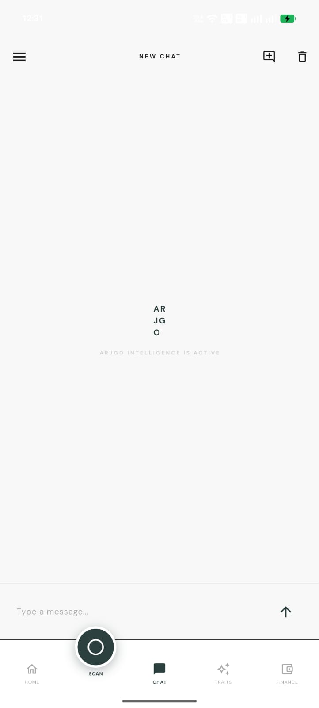
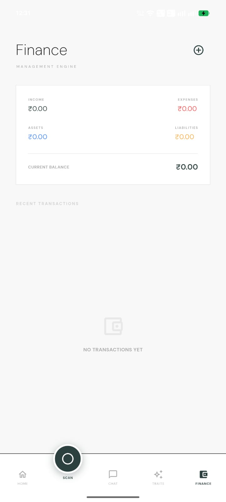

# ARJGO - Structured Local Intelligence

Arjgo is a minimalist, high-performance Flutter application designed to provide structured intelligence through a specialized Trait Pipeline System. It utilizes local Vision-Language Models (VLM) to analyze images and return actionable, engineered insights directly on your device.

---

## Visual Overview

| Home Screen | Chat Interface| Finance Management|
| :---: | :---: | :---: |
|  |  |  |

---

## Project Overview

Arjgo operates as a structured mirror, allowing you to view the world through specialized lenses known as Traits:

1.  Verdict-Based Analysis: Instant labels such as SNACKABLE or NOT SNACKABLE for rapid decision-making.
2.  Identity and Trends: Aesthetic scoring with identity labeling and trend tracking over time.
3.  Local-First Intelligence: Fully offline processing at localhost:8080, ensuring maximum privacy and zero latency.
4.  Personal RAG Memory: A semantic knowledge base that indexes your scans, logs, documents, and finances for context-aware chat.

---

## Core Architecture

### 1. The Trait Pipeline
Every scan follows a strict 6-step engineered lifecycle defined in the TraitExecutor:
- PreProcess: Image optimization (640px, 90% JPEG) for edge inference.
- Prompt Build: Dynamic personality-driven system prompts.
- Inference: Interaction with the local llama-server.
- Parse: Structured field extraction (Status, Score, Suggestions) from raw output.
- PostProcess: Identity assignment and trend comparison.
- Validate: Data cleaning and cognitive load limiting.

### 2. Local RAG and Vector Search
Arjgo features a robust local brain using SQLite and Vector search:
- Embeddings: all-MiniLM-L6-v2 (384d) via ONNX Runtime.
- Semantic Sync: Automatically indexes activity logs, scan results, and uploaded documents.
- Agentic Actions: The AI can execute background tasks such as creating logs directly from the chat interface.

---

## Local AI Infrastructure

Arjgo hosts its own AI backbone for maximum stability:
- Model: Qwen2-VL-2B (quantized to Q4_K_M).
- Server: Native llama-server bridge integrated via jniLibs (Android) and local binary (macOS).
- Inference API: OpenAI-compatible Chat Completion API (/v1/chat/completions).

---

## Technical Setup

### 1. Requirements
- Flutter SDK (>= 3.0.0)
- Android SDK (for mobile testing)
- 2GB+ free storage (for local model assets)

### 2. Environment Configuration
The application requires a .env file in the root directory. You can use the provided .env.example as a template:

```env
SUPABASE_URL=your_supabase_url
SUPABASE_ANON_KEY=your_supabase_anon_key
```

### 3. Build and Run
To fetch dependencies and run the application:
```bash
flutter pub get
flutter run
```

To build a release APK:
```bash
flutter build apk --release
```

---

## Visual Identity and Design
Arjgo follows a philosophy of Functional Minimalism:
- Typography: Exclusive use of DM Sans for geometric clarity.
- Palette: High-contrast Forest-Slate (#2D4040) on monochromatic backgrounds.
- Hallmarks: Each key screen includes the signature "Crafted by Arjgorithmic."

---

Developed by Arjgorithmic. All rights reserved.
